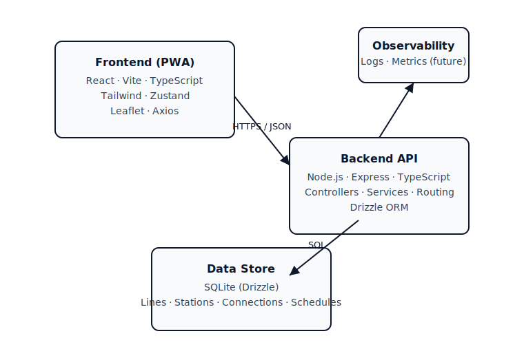

# Where is My Metro 🚇

A multi-city metro journey planner and live-status companion. Built as a fast PWA with offline-friendly UX, geolocation-powered station discovery, and schedule-based live train positioning.

## Highlights
- Multi-city datasets (Delhi, Bangalore, more coming) with interchange-aware routing
- Journey planner with step-by-step route, transfers, and travel time estimates
- Nearby stations via geolocation + map preview (Leaflet / OSM)
- PWA-ready: installable, works with flaky connectivity, cached assets
- TypeScript end-to-end with consistent models across API and client

## Architecture


See the mermaid source in [docs/architecture.md](docs/architecture.md).

### Data/Domain Flow
- `stations` + `station_connections` form the graph for routing
- `metro_lines` + `line_stations` define per-line ordering and colors
- `train_schedules` + peak/off-peak frequencies drive simulated live positions
- Geolocation → nearby stations → journey planning → rendered map + instructions

## Tech Stack
- **Frontend:** React 19, TypeScript, Vite, Tailwind CSS, Zustand, Leaflet, Axios
- **Backend:** Node.js, Express, TypeScript, Drizzle ORM, SQLite (MVP, swappable later)
- **Tooling:** ESLint, TypeScript project refs, PWA assets via Vite PWA plugin

## Project Structure
```
Where is My Metro/
├── frontend/                 # React PWA
│   ├── src/components/       # UI (journey, map, location, station, tracking)
│   ├── src/hooks/            # Data + UX hooks (geolocation, nearby, route)
│   ├── src/services/         # API clients
│   ├── src/store/            # Zustand slices
│   ├── src/types/            # Shared models
│   └── src/utils/            # Helpers (distance, time, colors)
├── backend/                  # Express API
│   ├── src/config/           # env, database
│   ├── src/controllers/      # HTTP handlers
│   ├── src/routes/           # Route registration
│   ├── src/services/         # Business logic (routing, tracking)
│   ├── src/db/               # Drizzle schema, migrations, seeds
│   └── data/                 # SQLite file (dev)
└── docs/                     # Design notes and plans
```

## Setup
### Prerequisites
- Node.js 18+
- npm (ships with Node)

### Backend
```bash
cd backend
npm install
npm run db:push   # create tables
npm run db:seed   # load multi-city data
npm run dev       # http://localhost:5000
```

### Frontend
```bash
cd frontend
npm install
npm run dev       # http://localhost:5173
```

### Environment
Backend `.env` example:
```env
PORT=5000
NODE_ENV=development
CORS_ORIGIN=http://localhost:5173
```

Frontend `.env` example:
```env
VITE_API_URL=http://localhost:5000/api
```

## Key API Endpoints
- `GET /api/health` — service heartbeat
- `GET /api/lines` — list metro lines
- `GET /api/stations` — list stations (filter with `?lineId=`)
- `GET /api/stations/nearby?lat=..&lng=..&radius=..` — nearby stations
- `POST /api/routes/find` — route between stations
  ```json
  {
    "origin": "station-id",
    "destination": "station-id",
    "departureTime": "2026-01-20T08:30:00Z"
  }
  ```

## Development Scripts
Backend
```bash
npm run dev        # start API with reload
npm run build      # compile TS
npm run start      # run compiled build
npm run db:push    # migrate schema
npm run db:seed    # seed data
npm run db:studio  # open Drizzle Studio
```

Frontend
```bash
npm run dev        # start Vite dev server
npm run build      # production build
npm run preview    # preview prod build
```

## Current State
- Multi-city datasets loaded (Delhi, Bangalore) with interchange and travel-time graph
- Journey planner + route display + transfer steps
- Nearby stations via geolocation, map overlay with Leaflet
- PWA installability with cached assets; offline-friendly UI copy

## Roadmap (next)
- Live sightings crowd input + moderation
- Fare estimates per operator
- Improved accessibility (keyboard + screen reader paths)
- Server-side caching layer (Redis) when moving beyond SQLite

## License
MIT
