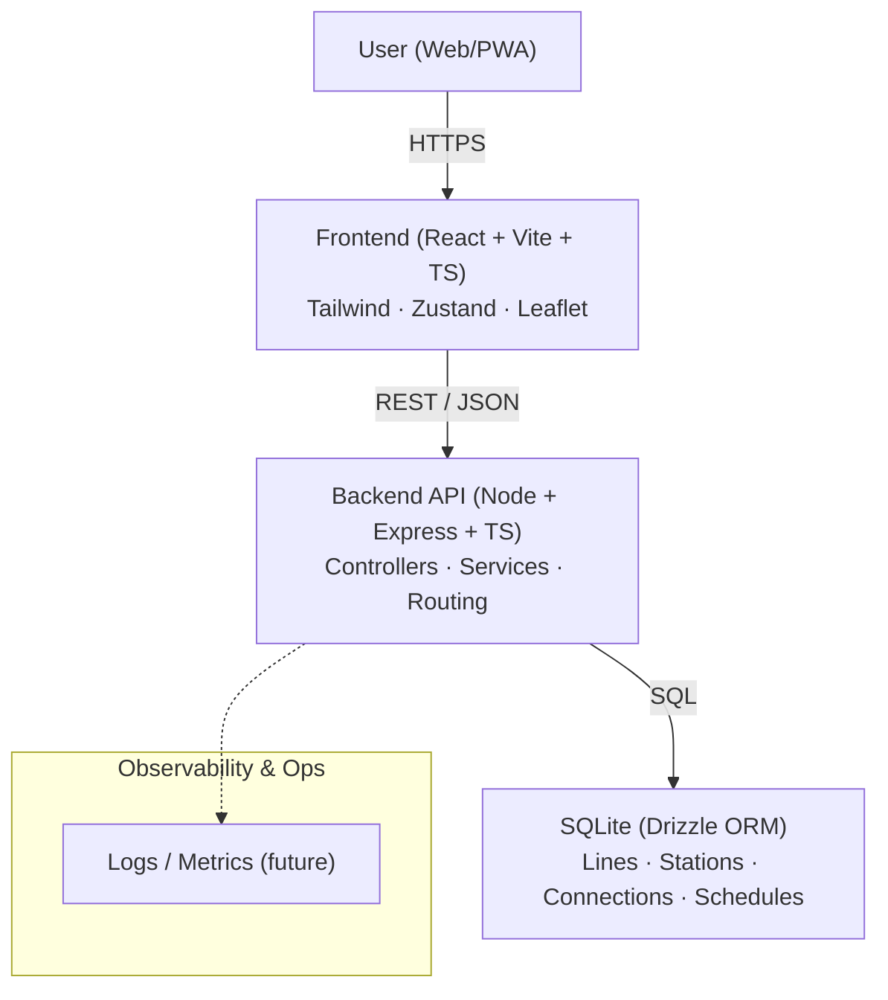

# Architecture Diagram

This diagram mirrors the multi-city setup: the frontend renders routing and live-status views, the API handles geospatial and routing logic, and SQLite (via Drizzle) stores lines, stations, connections, and schedules. The observability box is noted for future rollout when moving to heavier infra (e.g., Redis, Postgres, APM).